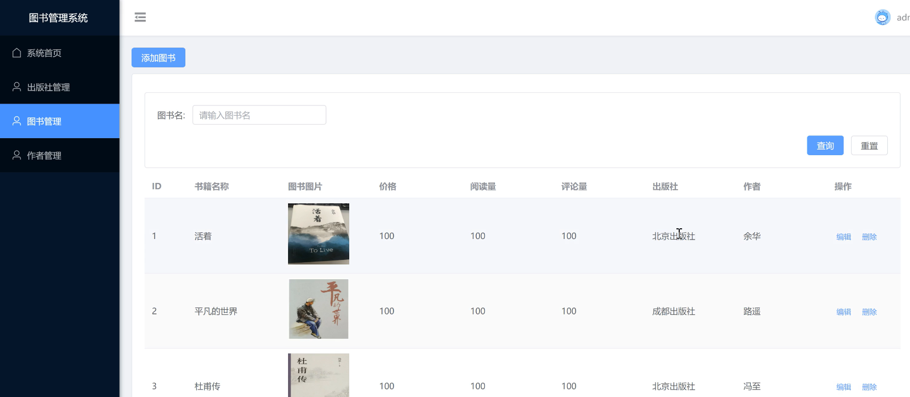

# 基于Fastapi+vue图书管理系统


最近研究了一下Fastapi的框架，感觉这个框架非常优秀，异步并发效率高而且会生成对应接口文档

因此写了一套基于Fastapi+vue图书管理系统

无偿免费全部分享给大家

如果大家在开发过程中遇到问题，欢迎联系作者微信 python_kk

如果咨询问题，请自觉发一个红包，不提供无偿咨询，谢谢大家


python3.7.3（python3.6+）

pycharm


运行结果





```python
# 所有依赖包 基于python3.10
# fastapi          python后端框架
# unicorn          运行fastapi插件类似 uwsgi
# tortoise-orm     类似django自带orm库
# aiomysql         fastapi连接mysql库
# aerich           数据库迁移库
# pyjwt            python生成jwt库
# python-multipart fastapi操作图片库


aerich==0.7.2
aiomysql==0.2.0
aiosqlite==0.17.0
annotated-types==0.6.0
anyio==4.3.0
click==8.1.7
colorama==0.4.6
dictdiffer==0.9.0
exceptiongroup==1.2.0
fastapi==0.110.1
h11==0.14.0
idna==3.6
iso8601==1.1.0
pydantic==2.6.4
pydantic_core==2.16.3
PyJWT==2.8.0
PyMySQL==1.1.0
pypika-tortoise==0.1.6
python-multipart==0.0.9
pytz==2024.1
sniffio==1.3.1
starlette==0.37.2
tomlkit==0.12.4
tortoise-orm==0.20.0
typing_extensions==4.11.0
unicorn==2.0.1.post1
uvicorn==0.29.0
```


1、创建虚拟环境的fastapi项目（自动安装 fastapi 和 uvicornweb服务器）


2、手动安装pip依赖

pip install fastapi -i https://pypi.tuna.tsinghua.edu.cn/simple

pip install unicorn -i https://pypi.tuna.tsinghua.edu.cn/simple

pip install uvicorn -i https://pypi.tuna.tsinghua.edu.cn/simple


3、安装tortoise_orm（orm操作mysql组件）

pip install tortoise-orm -i https://pypi.tuna.tsinghua.edu.cn/simple


4、修改main.py

```python
from fastapi import FastAPI
import uvicorn
from tortoise.contrib.fastapi import register_tortoise
from settings import TORTOISE_ORM

# 导入子路由
from api.student import api_student

app = FastAPI()

app.include_router(api_student,prefix="/students",tags=["students学生增删改查系列接口"])

register_tortoise(
    app=app,
    config=TORTOISE_ORM,
)

@app.get("/")
async def root():
    return {"message": "Hello World"}


@app.get("/hello/{name}")
async def say_hello(name: str):
    return {"message": f"Hello {name}"}

if __name__ == '__main__':
    uvicorn.run("main:app", host="127.0.0.1", port=8001, reload=True,workers=1)
```


5、新建 settings.py 文件 api（子路由子视图目录)


student.py

```python
from fastapi.exceptions import HTTPException

from models import *

# 这里是类似于 drf 的字段校验
from pydantic import BaseModel
from typing import List, Union
# 类似于django里的 path
from fastapi import APIRouter
# 生成路由对象
api_student = APIRouter()


# 查所有
@api_student.get("/")
async def getAllStudent():
    # 返回所有学生信息 班级信息 课程信息
    students = await Student.all().values("id","sno","pwd","name","clas__id","clas__name","courses__id","courses__name")
    # students = await Student.filter(name__icontains='a').values("name", "clas__name")
    # print("students", students)
    # for i in students:
    #     print(i)
    #
    # rain = await Student.get(name='rain')
    # print(rain, type(rain))
    # print(rain.sno)

    return students


class StudentModel(BaseModel):
    name: str
    pwd: str
    sno: int
    clas_id: Union[int, None] = None
    courses: List[int] = []

# 增加
@api_student.post("/")
async def addStudent(stu: StudentModel):
    # 添加数据库操作
    # 方式1
    # student = Student(name=stu.name, pwd=stu.pwd, sno=stu.sno, clas_id=stu.clas)
    # await student.save()
    # 方式2
    student = await Student.create(name=stu.name, pwd=stu.pwd, sno=stu.sno, clas_id=stu.clas_id)
    print(student, dir(student))

    # 添加多对多关系记录
    courses = await Course.filter(id__in=stu.courses)
    print("courses", courses)
    await student.courses.add(*courses)
    print("student", student.courses)

    return student

# 查看一个
@api_student.get("/{student_id}")
async def update_student(student_id: int):
    student = await Student.get(id=student_id).values("id","sno","pwd","name","clas__id","clas__name","courses__id","courses__name")

    return student

# 修改一个
@api_student.put("/{student_id}")
async def update_student(student_id: int, student: StudentModel):
    data = student.dict(exclude_unset=True)
    courses = data.pop("courses")
    print(data, courses)
    await Student.filter(id=student_id).update(**data)

    courses = await Course.filter(id__in=student.courses)
    edit_student = await Student.get(id=student_id)
    await edit_student.courses.clear()
    await edit_student.courses.add(*courses)

    return student

# 删除一个
@api_student.delete("/{student_id}")
async def delete_student(student_id: int):
    deleted_count = await Student.filter(id=student_id).delete()  # 条件删除
    if not deleted_count:
        raise HTTPException(status_code=404, detail=f"Student {student_id} not found")
    return {}
```


6、settings里设置mysql配置项

```python
TORTOISE_ORM = {
    'connections': {
        'default': {
            # 'engine': 'tortoise.backends.asyncpg',  PostgreSQL
            'engine': 'tortoise.backends.mysql',  # MySQL or Mariadb
            'credentials': {
                'host': '127.0.0.1',
                'port': '3306',
                'user': 'root',
                'password': '123456',
                'database': 'fastapi',
                'minsize': 1,
                'maxsize': 5,
                'charset': 'utf8mb4',
                "echo": True
            }
        },
    },
    'apps': {
        'models': {
            'models': ['models', "aerich.models"],
            'default_connection': 'default',

        }
    },
    'use_tz': False,
    'timezone': 'Asia/Shanghai'
}
```


7、新建models模型


8、如果出现报错，则安装 aiomysql

ModuleNotFoundError: No module named 'aiomysql'

异步操作数据库


pip install aiomysql -i https://pypi.tuna.tsinghua.edu.cn/simple


9、aerich是一种ORM迁移工具，需要结合tortoise异步orm框架使用。安装aerich

pip install aerich -i https://pypi.tuna.tsinghua.edu.cn/simple

aerich init -t settings.TORTOISE_ORM

aerich init-db


aerich migrate 修改迁移

aerich upgrade 真正迁移

aerich downgrade 回退迁移


10、跨域问题解决

```python
from fastapi.middleware.cors import CORSMiddleware

# origins = [
#     "http://localhost:63342"
# ]

app.add_middleware(
    CORSMiddleware,
    # allow_origins=origins,  # *：代表所有客户端
    allow_origins=["*"],  # *：代表所有客户端
    allow_credentials=True,
    allow_methods=["GET"],
    allow_headers=["*"],
)
```


11、注册接口

```python
from tortoise.contrib.fastapi import register_tortoise
from fastapi.middleware.cors import CORSMiddleware
from settings import TORTOISE_ORM,SECRET_KEY
from fastapi import FastAPI
from fastapi import Request, Response, status
from models import *
import uvicorn
import datetime
import jwt

# 前台返回格式
ret = {
    "data": {},
    "meta": {
        "status": 200,
        "message": "注册成功"
    }
}

# 注册接口
@app.post("/register")
async def register(request: Request):
    json_data = await request.json()
    username = json_data["username"]
    password = json_data["password"]
    value = json_data["value"]

    if value == '1':
        pass
    elif value == '2':
        user = await Chushou.filter(username=username, password=password)
        if len(user) != 0:
            ret["meta"]["status"] = 500
            ret["meta"]["message"] = "该商家已注册"
            return ret
        user = await Chushou.create(username=username, password=password)
        return ret
    else:
        user = await Goumai.filter(username=username, password=password)
        if len(user) != 0:
            ret["meta"]["status"] = 500
            ret["meta"]["message"] = "该用户已注册"
            return ret
        user = await Goumai.create(username=username, password=password)
        return ret
    return {"message": "register"}
```


12、jwt

pip install pyjwt -i https://pypi.tuna.tsinghua.edu.cn/simple

import jwt


13、登录接口

```python
from tortoise.contrib.fastapi import register_tortoise
from fastapi.middleware.cors import CORSMiddleware
from settings import TORTOISE_ORM,SECRET_KEY
from fastapi import FastAPI
from fastapi import Request, Response, status
from models import *
import uvicorn
import datetime
import jwt

# 登录接口
@app.post("/login")
async def register(request: Request):
    json_data = await request.json()
    username = json_data["username"]
    password = json_data["password"]
    value = int(json_data["value"])

    if value == 1:
        user = await Guanli.get(username=username, password=password)
        if not user:
            ret["meta"]["status"] = 500
            ret["meta"]["message"] = "用户不存在或密码错误"
            return ret
        elif user and user.password:
            dict = {
                "exp": datetime.datetime.now() + datetime.timedelta(days=1),  # 过期时间
                "iat": datetime.datetime.now(),  # 开始时间
                "id": user.id,
                "username": user.username,
            }
            token = jwt.encode(dict, SECRET_KEY, algorithm="HS256")
            ret["data"]["token"] = token
            ret["data"]["username"] = user.username
            ret["data"]["user_id"] = user.id
            # 这里需要根据数据库判断是不是管理员
            ret["data"]["isAdmin"] = 1
            ret["meta"]["status"] = 200
            ret["meta"]["message"] = "登录成功"
            print(ret, type(ret))
            return ret
        else:
            ret["meta"]["status"] = 500
            ret["meta"]["message"] = "用户不存在或密码错误"
            return ret
    elif value == 2:
        user = await Chushou.get(username=username, password=password)
        if not user:
            ret["meta"]["status"] = 500
            ret["meta"]["message"] = "用户不存在或密码错误"
            return ret
        elif user and user.password:
            dict = {
                "exp": datetime.datetime.now() + datetime.timedelta(days=1),  # 过期时间
                "iat": datetime.datetime.now(),  # 开始时间
                "id": user.id,
                "username": user.username,
            }
            token = jwt.encode(dict, SECRET_KEY, algorithm="HS256")
            ret["data"]["token"] = token
            ret["data"]["username"] = user.username
            ret["data"]["user_id"] = user.id
            # 这里需要根据数据库判断是不是管理员
            ret["data"]["isAdmin"] = 2
            ret["meta"]["status"] = 200
            ret["meta"]["message"] = "登录成功"
            print(ret, type(ret))
            return ret
        else:
            ret["meta"]["status"] = 500
            ret["meta"]["message"] = "用户不存在或密码错误"
            return ret
    else:
        user = await Goumai.get(username=username, password=password)
        if not user:
            ret["meta"]["status"] = 500
            ret["meta"]["message"] = "用户不存在或密码错误"
            return ret
        elif user and user.password:
            dict = {
                "exp": datetime.datetime.now() + datetime.timedelta(days=1),  # 过期时间
                "iat": datetime.datetime.now(),  # 开始时间
                "id": user.id,
                "username": user.username,
            }
            token = jwt.encode(dict, SECRET_KEY, algorithm="HS256")
            ret["data"]["token"] = token
            ret["data"]["username"] = user.username
            ret["data"]["jianjie"] = user.jianjie
            ret["data"]["img_url"] = user.img_url
            ret["data"]["user_id"] = user.id
            # 这里需要根据数据库判断是不是管理员
            ret["data"]["isAdmin"] = 3
            ret["meta"]["status"] = 200
            ret["meta"]["message"] = "登录成功"
            print(ret, type(ret))
            return ret
        else:
            ret["meta"]["status"] = 500
            ret["meta"]["message"] = "用户不存在或密码错误"
            return ret
```


14、上传图片

pip install python-multipart -i https://pypi.tuna.tsinghua.edu.cn/simple

```python
from fastapi import Request, Response, status,UploadFile,File

# 创建 upimg 图片文件夹

# 上传图片
@app.post("/img_upload")
async def img_upload(file: UploadFile = File(...)):
    contents = await file.read()
    response = {}

    # 构造图片保存路径 路径为<USER_AVATAR_ROOT + 文件名>
    # USER_AVATAR_ROOT刚刚在settings.py中规定过，需要导入进来
    # file_path = os.path.join(MEDIA_ROOT, file.filename)
    # 保存图片
    with open("./upimg/%s"%file.filename, 'wb+') as f:
        f.write(contents)
        f.close()
    response['file'] = file.filename  # 返回新的文件名
    response['code'] = 0
    response['msg'] = "图片上传成功！"
    return {'code': 200, 'message': '上传成功', 'data': response}
```


15、静态文件（访问图片）

```python
from fastapi.staticfiles import StaticFiles
from fastapi import FastAPI

app = FastAPI()

# 设置静态文件路由
app.mount("/img", StaticFiles(directory="upimg"), name="upimg")
```
